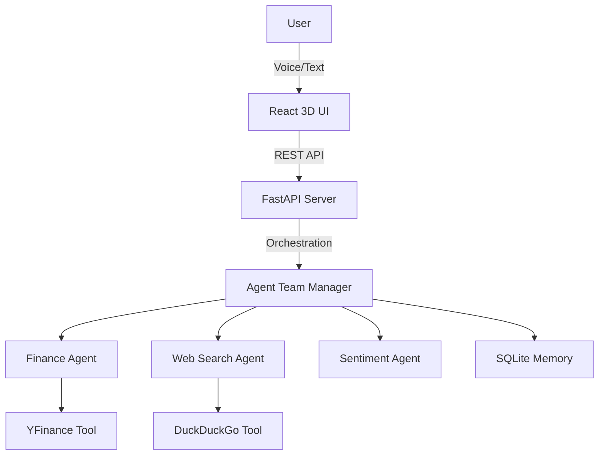

# 🚀 Agentic 3D Financial Intelligence Dashboard

An advanced, job-ready AI platform that leverages **Multi-Agent Orchestration**, **3D Visualizations**, and **Voice Interactivity** to provide real-time financial insights and sentiment analysis.


## 🌟 Key Features

- **Multi-Agent System**: Built with **Phidata**, featuring specialized agents for Financial Data, Web Search, and Sentiment Analysis.
- **3D Interactive UI**: A high-performance frontend built with **React Three Fiber** and **Tailwind CSS**, featuring a holographic market globe.
- **Voice Intelligence**: Integrated Web Speech API for bi-directional Voice-to-Text and Text-to-Speech interactions.
- **Persistent Memory**: SQLite-backed session management allowing agents to recall past interactions.
- **Decoupled Architecture**: Scalable **FastAPI** backend and **Vite/React** frontend.
- **Real-time Data**: Live stock metrics and news fetching via **YFinance** and **DuckDuckGo**.

## 🛠️ Tech Stack

- **Backend**: Python, FastAPI, Phidata, Groq (Llama 3.3), SQLAlchemy.
- **Frontend**: React, Three.js, React Three Fiber, Framer Motion, Tailwind CSS.
- **DevOps**: Docker, Docker Compose.
- **Data**: YFinance, DuckDuckGo Search.

## 🏗️ Architecture



## 🚀 Getting Started

### Prerequisites
- Python 3.9+
- Node.js 18+
- Groq API Key

### Installation

1. **Clone the repo:**
   ```bash
   git clone https://github.com/yourusername/agentic-finance-3d.git
   cd agentic-finance-3d
   ```

2. **Setup Backend:**
   ```bash
   python -m venv venv
   source venv/bin/activate  # venv\Scripts\activate on Windows
   pip install -r requirements.txt
   cp .env.example .env  # Add your keys here
   uvicorn api:app --reload
   ```

3. **Setup Frontend:**
   ```bash
   cd frontend
   npm install
   npm run dev
   ```

## 🐳 Docker Deployment

Run the entire stack with a single command:
```bash
docker-compose up --build
```

## 📄 License
MIT License. Created by [Your Name].
